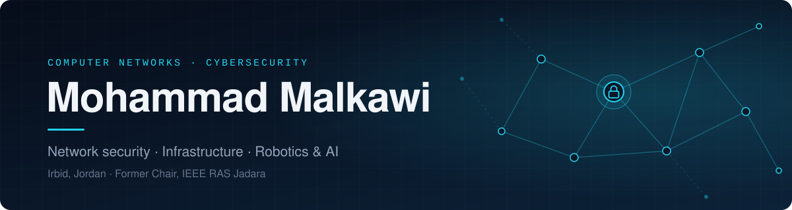

## About me

Hi, I'm **Mohammad** — a Computer Networks & Cybersecurity student from Irbid, Jordan.

I'm interested in how connected systems are built and how they stay safe: how data moves across a network, where that path can be attacked, and how to design infrastructure that holds up. Outside my major, I build robotics and AI projects and have led student engineering communities through IEEE.

<table>
  <tr>
    <td width="33%" valign="top">
      <h4>🌐 Networking</h4>
      Designing reliable networks and understanding the protocols that keep systems talking to each other.
    </td>
    <td width="33%" valign="top">
      <h4>🔐 Security</h4>
      Learning how systems are attacked so I can defend them — traffic analysis, hardening, and secure design.
    </td>
    <td width="33%" valign="top">
      <h4>🤖 Robotics & AI</h4>
      Bringing machine learning onto real hardware, from smart traffic control to autonomous robots.
    </td>
  </tr>
</table>

> **Currently open to** networking & cybersecurity internships, research collaborations, and student-led initiatives.

## Featured projects

### 🚦 SALKA — Adaptive Traffic Management

Traffic lights in most cities run on fixed timers, whatever the actual traffic looks like. **SALKA** predicts how traffic will flow and adjusts signal timing to match. It was piloted at **Culture Circle in Irbid**, with national deployment as the goal.

| | |
|:--|:--|
| **How it works** | Traffic is modelled in **SUMO** and controlled live through **TraCI**. An **LSTM** model forecasts incoming flow, and the signal controller adapts its timing to those predictions. |
| **Built with** |     |

### 🌱 C-Layer — Autonomous CO₂ Capture Robot

Industrial carbon-capture filters need regular replacement, which is slow and manual. **C-Layer** is a robot that swaps them automatically and predicts when they need to be swapped. It was a **finalist** in a university Creative Innovation Competition.

| | |
|:--|:--|
| **How it works** | Runs on an **NVIDIA Jetson Nano**, which drives the filter-swapping mechanism. An **LSTM** model tracks filter condition over time to schedule maintenance before performance drops. |
| **Built with** |    |

## Leadership

| Role | Impact |
|:--|:--|
| **Former Chair** · IEEE RAS Jadara | Led the university's Robotics & Automation Society student chapter. |
| **Organizer** · RoboCraft | Grew RoboCraft into a national-level robotics competition with **95+ teams** and **~300 participants**. |
| **Fundraising** · IEEE | Secured the **IEEE RAS Chapter Initiative Grant** and additional support from **IEEE Young Professionals Jordan**. |
| **Competitor** · Hackathons | Hackathons and innovation challenges at the intersection of AI, hardware, and infrastructure. |

## Tech stack

  

 

